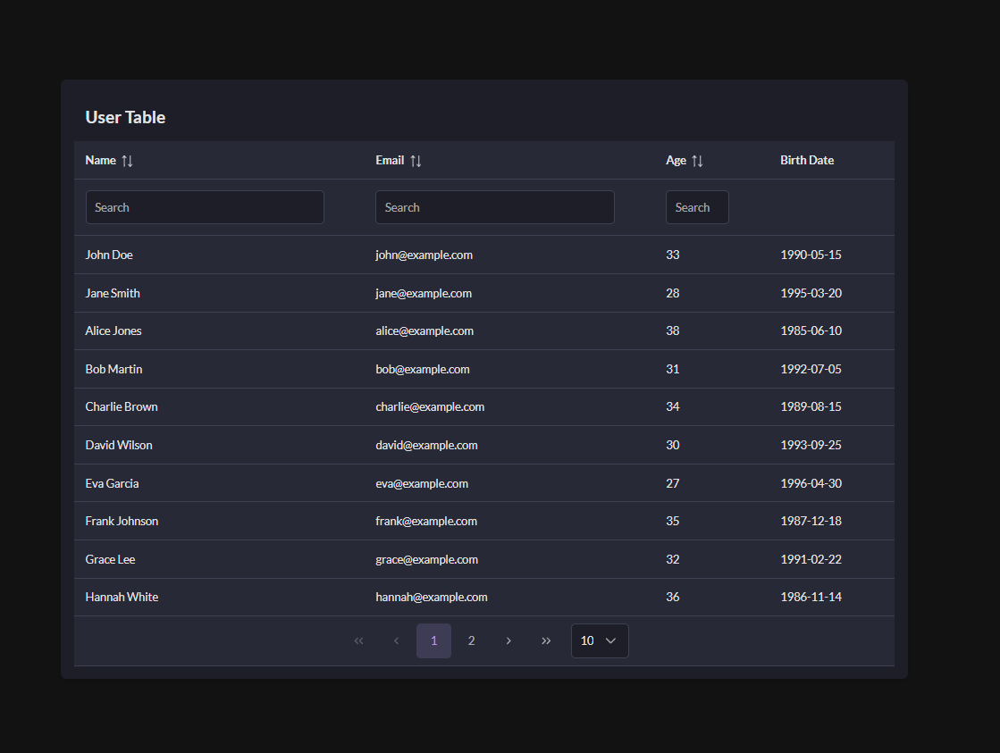

# React DataTable

## Introduction

This project is a single-page application that fetches and displays user data in a table format. Users can sort by columns and paginate the results. The project is constructed using React with TypeScript and leverages PrimeReact for UI components. Testing is accomplished with the Jest library.

## Features

- Display user details in a table.\
- Filter users based on their name, email, or age.\
- View age calculated based on birth date.\
- Use of React context for state management.\
- Unit tests with the use of Jest and @testing-library/react.\
- Integration with the PrimeReact UI library for enhanced interface.

## Directory Structure

- src/
  - components/   # Houses the UserTable component for tabular display.
  - context/      # Contains the UserContext to share user data across components.
  - services/     # Includes the userService which fetches mock user data.
  - App.tsx       # The main App component.
  - index.tsx     # The entry point of the React application.
  - mockdata.json # Mock data for users.

## Setup

#### 1. Prerequisites: Ensure you have Node.js and npm installed.
#### 2. Installation

- npm install

#### 3. Running the app locally

- npm start

## Testing

Run the unit tests using:
- npm test

## Contribution

Feel free to contribute! Please follow standard coding conventions and add appropriate tests when necessary.

